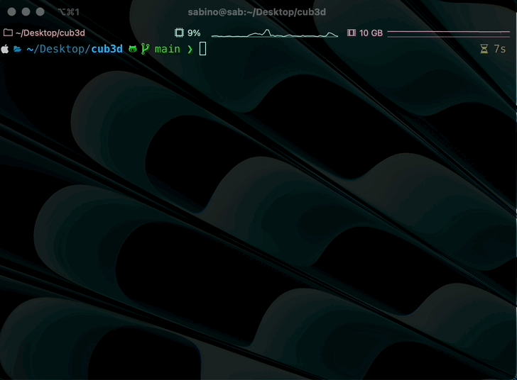

[](./README.md) [](./fr/README.md)

# 🎮 Cub3D 🎮
Learning RayCasting with a simple Wolfenstein 3D

---

Cub3D is a project where we implement a basic raycaster inspired by the original Wolfenstein 3D. It is a first-person perspective game where you navigate a maze-like environment using a raycasting algorithm to render the world.


## 🚀 Getting Started

### 1. Clone the Repository
```bash
git clone https://github.com/lazzylife42/cub3d
cd cub3d
```

### 2. Build the Project



The project is designed to be built on macOS. You can run `make` for the mandatory part of the project, or `make bonus` for the bonus features such as opening doors, mini-maps, mouse control, and more.
```bash
make
# or
make bonus
```

### 3. Run the Game
You can run the game by passing one of the maps from the `map` folder as the second argument.
```bash
./cub3D map/lab.cub
```

## 🎮 Controls

- **`ENTER`**: Start the game from the start menu
- **`WASD`**: Move the player
- **Mouse** or **Arrow Keys**: Rotate the camera
- **`O`**: Open and close doors
- **`M`**: Open the mini-map

## 📚 Learning Objectives
- Understanding raycasting techniques.
- Familiarity with basic graphics rendering.
- Building a simple 3D game engine from scratch.

---