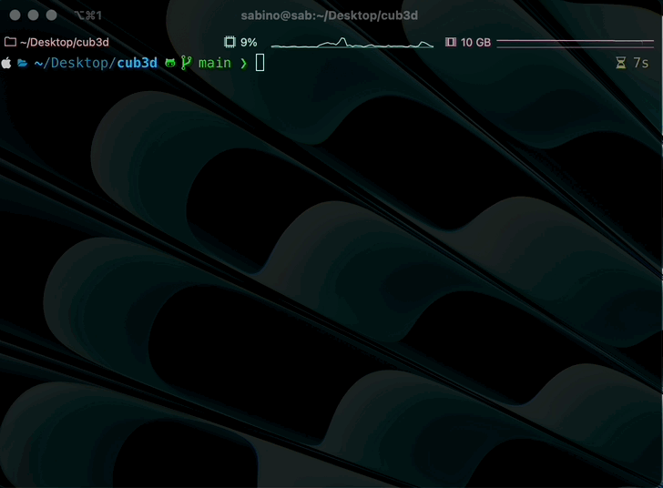

[](../README.md) [](./README.md)

# 🎮 Cub3D 🎮
Apprendre le RayCasting avec un simple Wolfenstein 3D

---

Cub3D est un projet où nous implémentons un raycaster basique inspiré de l'original Wolfenstein 3D. C'est un jeu en vue à la première personne où vous explorez un environnement labyrinthique en utilisant un algorithme de raycasting pour rendre le monde en 3D.


## 🚀 Pour commencer

### 1. Cloner le dépôt
```bash
git clone https://github.com/lazzylife42/cub3d
cd cub3d
```

### 2. Compiler le projet



Le projet est conçu pour être compilé sur macOS. Vous pouvez exécuter `make` pour la partie obligatoire du projet, ou `make bonus` pour les fonctionnalités bonus telles que l'ouverture des portes, les mini-cartes, le contrôle à la souris, etc.
```bash
make
# ou
make bonus
```

### 3. Lancer le jeu
Vous pouvez lancer le jeu en passant l'une des cartes du dossier `map` en second argument.
```bash
./cub3D map/lab.cub
```

## 🎮 Contrôles

- **`ENTRÉE`** : Démarrer le jeu depuis le menu de démarrage
- **`WASD`** : Déplacer le joueur
- **Souris** ou **Flèches directionnelles** : Faire pivoter la caméra
- **`O`** : Ouvrir et fermer les portes
- **`M`** : Ouvrir la mini-carte

## 📚 Objectifs pédagogiques
- Comprendre les techniques de raycasting.
- Se familiariser avec les bases du rendu graphique.
- Construire un moteur de jeu 3D simple à partir de zéro.
